```mermaid
flowchart LR
    A["Fresh venue catalogues"] --> B["Canonical events and markets"]
    B --> C["Cross-venue event matching"]
    C --> D["Rules and relationship evidence"]
    D --> E["Event admission and ranking"]
    E --> F["Timestamped selection report"]
    F --> G["Immutable run archive"]
    G --> H["Atomic target generation"]
    H --> I["Venue splices"]
```

# Targeter

The targeter decides **which event families are worth recording**. It is the
bridge between a very large venue catalogue and a deliberately small, durable
capture set.

The project can analyze historical data after the fact, but it cannot recreate
an order book that was never recorded. That makes target selection an
irreversible resource-allocation decision: every unnecessary subscription
costs network, disk, and review time, while every missed event leaves a hole no
later model can repair.

## Motivation

The first analysis pass did not find a robust tradable edge. It did reveal why
collecting more of the same data would be a poor response:

- heavily traded short-duration crypto ladders are already efficient and give
  us little time to observe market structure;
- a single-venue anomaly has been studied extensively and is difficult to
  distinguish from stale data, fees, or settlement details;
- scanning every listed contract spends most of the pipeline on illiquid or
  analytically isolated markets;
- newly created markets usually have neither mature prices nor the sibling
  structure needed for combinatorial analysis.

The working hypothesis is narrower: **mature, liquid sports events represented
on multiple venues are the best first search space for reusable combinatorial
relationships**. Sports outcomes have a compact normal path, and the same event
often exposes moneyline, spread, total, correct-score, and map/series products.
Those products can imply, exclude, or replicate one another without requiring
event-specific code.

The targeter does not claim that such a relationship is an arbitrage. It finds
event families for which collecting synchronized evidence is worth the cost.

## What the targeter selects

The unit of admission is an **event**, not an individual sibling market.

For the current sports strategy, an event is worth considering when:

1. the same participants and start time match across at least two venues;
2. trusted moneyline anchors have at least USD/USDC 25,000 of known combined
   lifetime volume;
3. at least one useful modeled relationship survives across venues;
4. the event is inside the capture window, beginning one hour before its
   scheduled start; and
5. it has not passed the configured post-start retention window.

Three venues rank ahead of two. Venue coverage, relationship quality, market
class breadth, and activity then rank admitted events under explicit
subscription budgets.

The dollar gate intentionally excludes values whose units are not dollars.
Polymarket `volumeNum` and Limitless formatted USDC volume can contribute.
Kalshi `volume_fp` is a contract count and cannot contribute unless the API
also supplies an explicit dollar-volume field. A contract trading at $0.20 is
not one dollar of turnover merely because its maximum settlement value is one
dollar.

## Siblings are capture surface, not a veto

Once an event is admitted, its markets are evaluated independently. A sibling
is excluded when it is closed, too new, semantically contradictory, or absent
from any relationship the engine can currently model.

That exclusion is recorded under `market_exclusions`; it does **not** reject
the event or every other sibling. The event is rejected only if the surviving
set can no longer satisfy an event-level invariant, such as minimum venue
coverage or any useful cross-venue relationship.

This distinction matters. Real venue groups contain halftime markets, unusual
settlement scopes, malformed metadata, and products we have not modeled yet.
Requiring every sibling to pass would make one irrelevant contract erase a
valuable event. Accepting every sibling would spend capture capacity on data we
cannot interpret. Independent market filtering gives us the useful middle.

## Why sports first

Sports are not the final limit of the system. They are the first domain where
autonomous matching is ambitious but still testable:

- participant identities and scheduled times provide conservative event keys;
- normal settlement outcomes are enumerable;
- product families repeat across matches and seasons;
- rules can be reduced into reusable venue/product templates;
- the same logical event is commonly traded on two or three platforms.

Macro, political, and bespoke markets can be added as separate strategies
later. The intended long-term architecture is a targeter that orchestrates
independent discovery strategies behind the same event, report, archive, and
publication contracts.

## Semantic boundary

The targeter does not infer contract meaning from arbitrary prose at runtime.
`configs/targeter_v2.json` maps reusable vendor product shapes to canonical
classes such as:

- `soccer.moneyline_3way`;
- `soccer.spread`;
- `soccer.total_goals`;
- `soccer.correct_score`;
- `esports.series_moneyline`;
- `esports.map_winner`; and
- `esports.map_handicap`.

Rule text is normalized into content-addressed templates for drift and review.
Only narrow contradictions to the configured happy path block a market, such
as a regulation-time class whose rules explicitly include extra time. New or
changed templates are surfaced as evidence; a future reviewer UI can approve
or deny them without putting a language model in the live selection path.

Relationships are likewise conditional discovery evidence. Soccer uses a
bounded score space, so its findings carry incomplete-coverage metadata and
must not be presented as unconditional executable baskets.

### Reviewed esports families

The shipped registry configures League of Legends, Counter-Strike 2, Dota 2,
and Valorant. Reviewed products are series winner, numbered map/game winner,
total maps/games, and series map/game handicap. Classification requires venue
metadata and exact configured product mappings; similar tournament tickers and
within-map props are not guessed.

Honor of Kings is not configured. The game-family machinery is generic and
would carry it, but no reviewed Kalshi match product exists, so it could never
clear the two-venue minimum — discovering it would only spend vendor budget on
events that can never be selected. `docs/TARGETER_V2_MULTI_GAME_ESPORTS_V1.md`
keeps the design record; adding the family back is a config change once a
second venue publishes reviewable products. Relationship construction is
exhaustive only
for normal BO1, BO3, BO5, BO7, and BO9 first-to-clinch series. Even formats such
as BO2 are preserved in reports and rejected as `unsupported_series_format`.

## Process shape

Targeter v2 is a scheduled one-shot transaction, not a long-lived daemon.



Each invocation starts from fresh vendor state, acquires a filesystem lease,
and writes one timestamped run. A scheduler owns cadence. This design gives
every decision a finite input snapshot, prevents overlapping discoveries, and
avoids carrying stale in-memory state from one run to the next.

The four modes are:

| Mode | Effect |
|---|---|
| `shadow` | Fetch, normalize, match, and write a local report only |
| `archive` | Shadow run plus immutable object-store archival |
| `publish` | Archive, verify, and atomically replace the live target generation |
| `audit` | Verify the current generation and archive without discovery |

Publication is deliberately harder than discovery. An incomplete vendor run,
empty selection, archive verification failure, or partial local generation
cannot replace the last valid target pointer.

## Running locally

Run one fresh shadow pass:

```bash
.venv/bin/python targeter/run_v2.py \
  --mode shadow \
  --strategy configs/targeter_v2.json
```

For repeated observation without retaining large raw HTTP bodies:

```bash
.venv/bin/python targeter/run_v2.py \
  --mode shadow \
  --no-response-cache \
  --strategy configs/targeter_v2.json \
  --cache-root data/targeter-v2-monitor-state \
  --output-root data/targeter-v2-shadow
```

`--no-response-cache` still makes live API requests and retains durable
per-host rate-limit state. It keeps the normalized catalogue and report for
each run, which are the artifacts needed to compare targeter behavior over
time. `--reuse-cache` is the explicit offline/debug option and is mutually
exclusive with this mode. When response caching is enabled, Targeter v2 stores
each canonical JSON body as one checksummed Zstandard frame (`.json.zst`) and
keeps its decoded/stored identities in the adjacent metadata file.

Every successful or incomplete run writes:

```text
data/targeter-v2-shadow/<run-id>/
  catalog_<venue>_events.ndjson.zst
  catalog_<venue>_markets.ndjson.zst
  rule_templates.ndjson.zst
  rule_drift.ndjson.zst
  selection_report.json.zst
  selection_report.meta.json
```

The `.zst` files use the shared `encoder` profile: exact NDJSON, level 3, frame
checksum enabled, one frame, and no dictionary. Their decoded and stored
identities are committed in the report, while `selection_report.meta.json`
commits the report frame itself. All identities are carried through the run
manifest and archive receipt. For a directly inspectable shadow run, pass
`--artifact-format ndjson`; this emits the normalized artifacts as `.ndjson`
and the report as plain `selection_report.json`, without changing selection
semantics or the raw-response cache format.

Start with the decoded `selection_report.json.zst` (or the plain
`selection_report.json` override) when reviewing a run:

- `input_complete` proves whether all expected catalogues completed;
- `candidates` contains one record per matched event bundle;
- `event_status` and `rejection_reasons` explain event admission;
- `admission` records known volume, the threshold, and missing-volume coverage;
- `market_exclusions` explains individually discarded siblings; and
- `selection.targets` is the proposed subscription set.

Shadow mode never changes a splice subscription and never uploads to S3.

## Code map

| Path | Responsibility |
|---|---|
| `v2/adapters.py` | Public venue API boundary and normalization |
| `v2/domain.py` | Venue-independent events, markets, bundles, and reports |
| `v2/matching.py` | Conservative cross-venue event matching |
| `v2/relationships.py` | Outcome masks and structural relationships |
| `v2/rules.py` | Rule normalization, drift, and explicit contradictions |
| `v2/selection.py` | Event admission, market exclusion, ranking, and budgets |
| `v2/run.py` | One-shot discovery and report materialization |
| `v2/run_archive.py` | Immutable target-run archival |
| `v2/publication.py` | Verified atomic multi-venue target publication |
| `targets.py` | Splice-side committed-generation reader |
| `TARGETER.md` | Legacy v1 crypto-ladder target protocol |

The normative implementation contracts live in
[`../docs/TARGETER_V2_PHASES_1_5.md`](../docs/TARGETER_V2_PHASES_1_5.md) and
[`../docs/TARGETER_V2_PHASES_6_10.md`](../docs/TARGETER_V2_PHASES_6_10.md).

## Current rollout rule

Run shadow monitoring until the selector repeatedly finds complete, liquid,
multi-venue event bundles and its rejection evidence looks credible. Only then
enable S3-backed `publish`, audit the committed generation, and point the
splices at it.

The order is intentional: first prove that the targeter chooses useful work,
then pay the operational cost of recording it.
